# GraspGen-位姿生成与抓取

## 

本文通过TensorRT加速YoloV8-Pose推理，使用主成分分析实现了一种基于位姿生成工具，实现了实时的位姿生成与抓取。

## 标签

PiPER机械臂、YoloV8-Pose模型、TensorRT、运动学正逆解、位姿控制、夹爪控制

## 仓库

- GraspGen:[https://github.com/vanstrong12138/GraspGen](https://github.com/vanstrong12138/GraspGen)
- Agilex-Collge:[https://github.com/agilexrobotics/Agilex-College/tree/master](https://github.com/agilexrobotics/Agilex-College/tree/master)

## 环境配置

支持桌面平台与Jetson平台双平台部署

### 桌面平台

- Ubuntu20.04
- ROS noetic
- NVIDIA Driver Version  470.256.02
- CUDA Version  11.4
- cuDNN 8.4.1
- TensorRT 8.6.1.6
- OpenCV 4.5.3

1. 安装NVIDIA显卡驱动
```bash
sudo apt update
sudo apt upgrade
sudo add-apt-repository ppa:graphics-drivers/ppa
sudo apt update
sudo apt install nvidia-driver-470
#重启
reboot
```

2. 安装CUDA Toolkit 11.4

-   先前往[NVIDIA官网](https://developer.nvidia.com/cuda-11-4-0-download-archive?target_os=Linux&target_arch=x86_64&Distribution=Ubuntu&target_version=20.04&target_type=runfile_local)下载CUDA的runfile文件
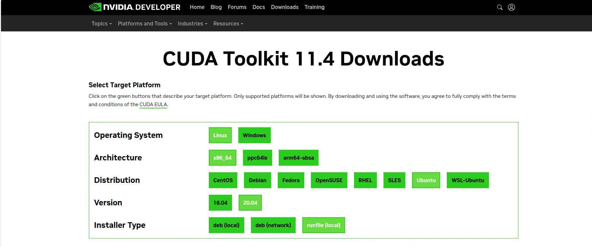

- 执行安装命令
```bash
wget https://developer.download.nvidia.com/compute/cuda/11.4.0/local_installers/cuda_11.4.0_470.42.01_linux.run
sudo sh cuda_11.4.0_470.42.01_linux.run
```
-   安装时取消勾选第一项driver，因为我们第一步已经安装过显卡驱动了

3. 添加环境变量
```bash
echo 'export PATH=/usr/local/cuda-11.4/bin:$PATH' >> ~/.bashrc
echo 'export LD_LIBRARY_PATH=/usr/local/cuda-11.4/lib64:$LD_LIBRARY_PATH' >> ~/.bashrc
source ~/.bashrc
```

4. 安装后可以执行nvcc -V查看CUDA信息
```bash
nvcc -V
```

5. 安装cuDNN
-   去[NVIDIA官网](https://developer.nvidia.com/nvidia-tensorrt-8x-download)下载TensorRT的tar文件，解压后对文件进行拷贝
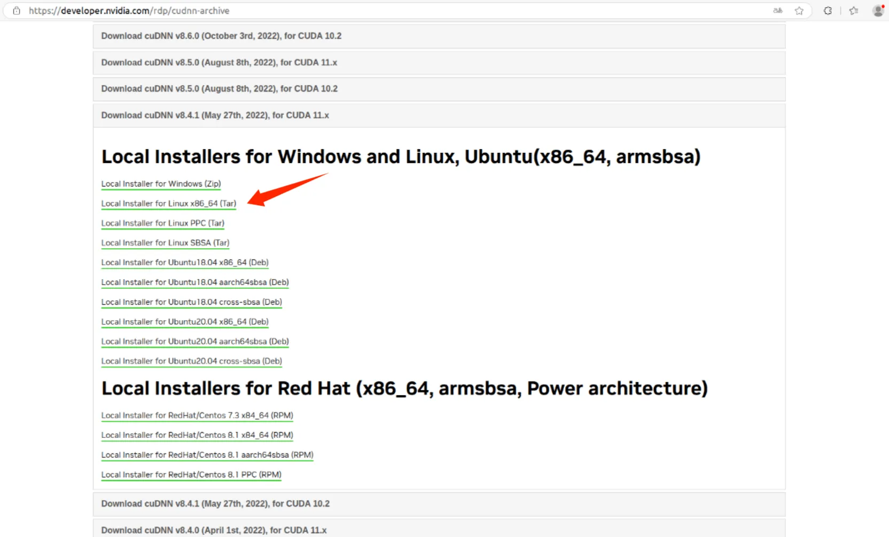

-     解压后执行下面的命令把cuDNN拷贝到CUDA的安装目录下
```bash
sudo cp cuda/include/cudnn*.h /usr/local/cuda/include
sudo cp cuda/lib/libcudnn* /usr/local/cuda/lib64
sudo chmod a+r /usr/local/cuda/include/cudnn*.h /usr/local/cuda/lib64/libcudnn*
```

6. 安装TensorRT，去[NVIDIA官网](https://developer.nvidia.com/nvidia-tensorrt-8x-download)下载TensorRT的tar文件，解压后对文件进行拷贝
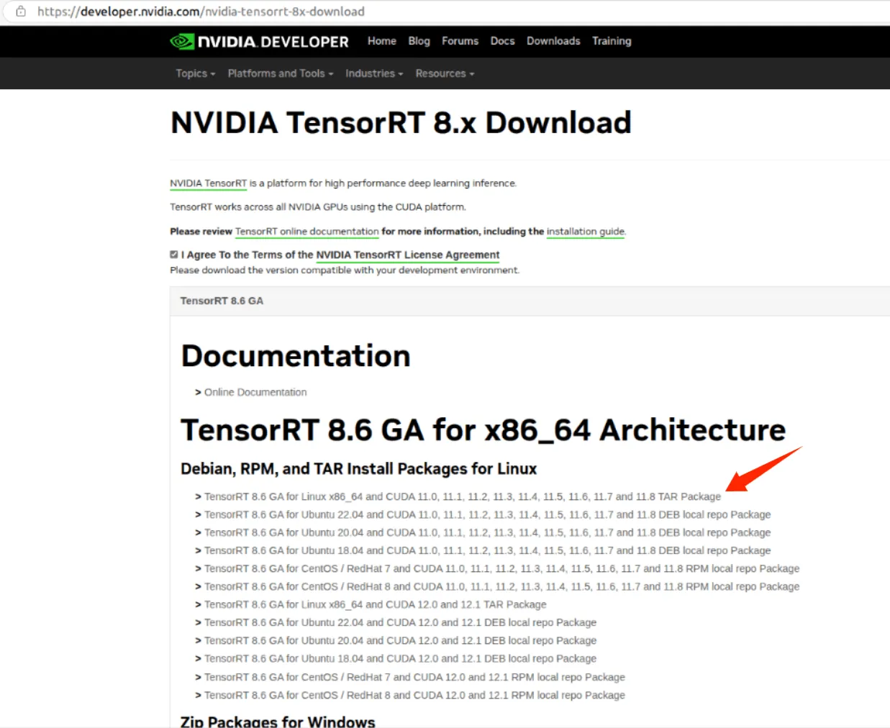

-   解压后执行下面的命令把TensorRT拷贝到/usr/local目录下

```bash
#解压
tar -xvf TensorRT-8.6.1.6.Linux.x86_64-gnu.cuda-12.0.tar.gz 

#进入TensorRT-8.6.1.6.Linux.x86_64-gnu.cuda-11.8
cd TensorRT-8.6.1.6.Linux.x86_64-gnu.cuda-11.8/

#拷贝到/usr/local目录下
sudo mv TensorRT-8.6.1.6/ /usr/local/
```

- 测试TensorRT是否安装成功
```bash
#进入MNIST手写数字识别的目录下
cd /usr/local/TensorRT-8.6.1.6/samples/sampleOnnxMNIST

#编译
make

#在/usr/local/TensorRT-8.6.1.6/bin找到可执行文件sample_onnx_mnist
cd /usr/local/TensorRT-8.6.1.6/bin
./sample_onnx_mnist
```

7. 安装带CUDA加速的OpenCV

- [去官网下载OpenCV 4.5.3](https://opencv.org/releases/page/2/)，解压后进入目录
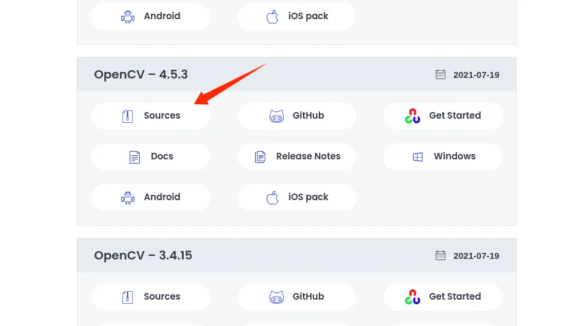

- 安装opencv依赖
```bash
sudo apt install build-essential cmake git pkg-config libgtk-3-dev libavcodec-dev libavformat-dev libswscale-dev libv4l-dev libxvidcore-dev libx264-dev libjpeg-dev libpng-dev libtiff-dev gfortran openexr libatlas-base-dev python3-dev python3-numpy libtbb2 libtbb-dev libdc1394-22-dev
```

- Github下载[opencv_contrib](https://github.com/opencv/opencv_contrib.git)并将opencv_contrib放入opencv目录里（也可以放在其他目录，但需要修改cmake编译时的命令）

- 预编译，执行下面的命令指定编译时候的参数，注意-D OPENCV_EXTRA_MODULES_PATH=your_opencv-contirb-modules_path修改为自定义的路径
```bash
cmake \
-D WITH_CUDA=ON \
-D CUDA_ARCH_BIN="8.6" \
-D WITH_CUDNN=ON \
-D OPENCV_DNN_CUDA=ON  \
-D cuDNN_VERSION='8.4' \
-D cuDNN_INCLUDE_DIR='/usr/local/cuda/include' \
-D CUDA_ARCH_PTX="" \
-D OPENCV_EXTRA_MODULES_PATH=/home/khalillee/opencv-4.5.3/opencv_contrib-4.5.3/modules \
-D WITH_GSTREAMER=ON \
-D WITH_LIBV4L=ON  \
-D BUILD_opencv_python3=ON \
-D BUILD_TESTS=OFF \
-D BUILD_PERF_TESTS=OFF \
-D BUILD_EXAMPLES=OFF \
-D CMAKE_BUILD_TYPE=RELEASE \
-D CMAKE_INSTALL_PREFIX=/usr/local \
-D ENABLE_FAST_MATH=1 \
-D CUDA_FAST_MATH=1 \
-D WITH_CUBLAS=1 \
-D PYTHON3_EXECUTABLE=$(which python3) \
-D PYTHON3_INCLUDE_DIR=$(python3 -c "from distutils.sysconfig import get_python_inc; print(get_python_inc())") \
-D PYTHON3_PACKAGES_PATH=$(python3 -c "from distutils.sysconfig import get_python_lib; print(get_python_lib())") \
-D OPENCV_ENABLE_NONFREE=ON \
-D PYTHON3_NUMPY_INCLUDE_DIRS=/usr/lib/python3/dist-packages/numpy/core/include \
-D PYTHON3_PACKAGES_PATH=/usr/lib/python3/dist-packages \
-D PYTHON_DEFAULT_EXECUTABLE=$(which python3) \
-D OPENCV_PYTHON3_INSTALL_PATH=/usr/lib/python3/dist-packages \
-D BUILD_opencv_python3=ON \
-D BUILD_opencv_python2=OFF \
-D HAVE_opencv_python3=ON \
-D INSTALL_PYTHON_EXAMPLES=ON \
-D INSTALL_C_EXAMPLES=ON \
-D BUILD_opencv_python3=ON \
-D OPENCV_GENERATE_PKGCONFIG=YES \
.. 
```

- 此步骤较慢请耐心等待，完成后正式开始编译
```bash
# nproc为CPU线程数量
make -j$(nproc) 

#安装
sudo make install
```

- 将OpenCV的库添加到环境
```bash
sudo gedit /etc/ld.so.conf.d/opencv4.conf 
```

- 执行此命令后打开的可能是一个空白的文件，只需要在文件末尾加上/usr/local/lib

- 更新系统动态链接器缓存，使系统能够正确地找到库文件
```bash
sudo ldconfig
```

- 配置环境变量，编辑/etc/bash.bashrc
```bash
sudo gedit /etc/bash.bashrc

#在文件最后添加
PKG_CONFIG_PATH=$PKG_CONFIG_PATH:/usr/local/lib/pkgconfig 
export PKG_CONFIG_PATH 
#然后保存并退出
```

- 然后执行source /etc/bash.bashrc使环境变量生效，最后输入pkg-config --modversion opencv4来查看opencv的版本

8. 安装此项目所依赖的ROS包
```bash
sudo apt install -y ros-noetic-sensor-msgs ros-noetic-image-transport ros-noetic-cv-bridge ros-noetic-vision-msgs ros-noetic-image-geometry ros-noetic-pcl-conversions ros-noetic-pcl-ros ros-noetic-message-filters
```

### Jetson Orin

- Ubuntu20.04
- ROS noetic
- JetPack 5.1.5
- CUDA 11.4.315
- cuDNN 8.6.0.166
- TensorRT 8.5.2.2

1. 下载[SDKManager](https://developer.nvidia.com/sdk-manager)JetPack 5.1.5
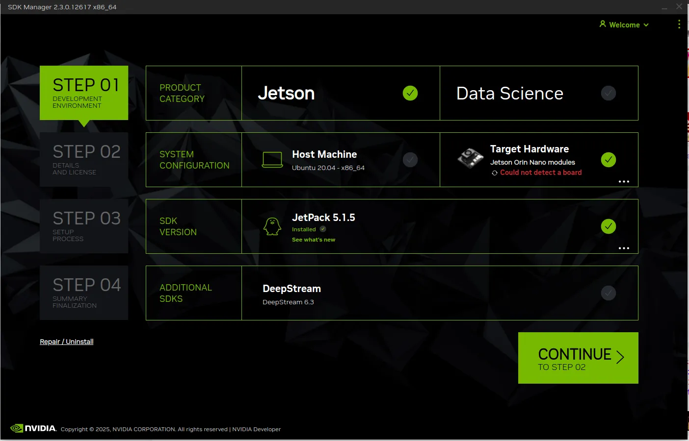

2. 选择只刷入系统还是刷入全部组件（如果只刷了系统，后续进入系统后还可手动安装上述依赖）
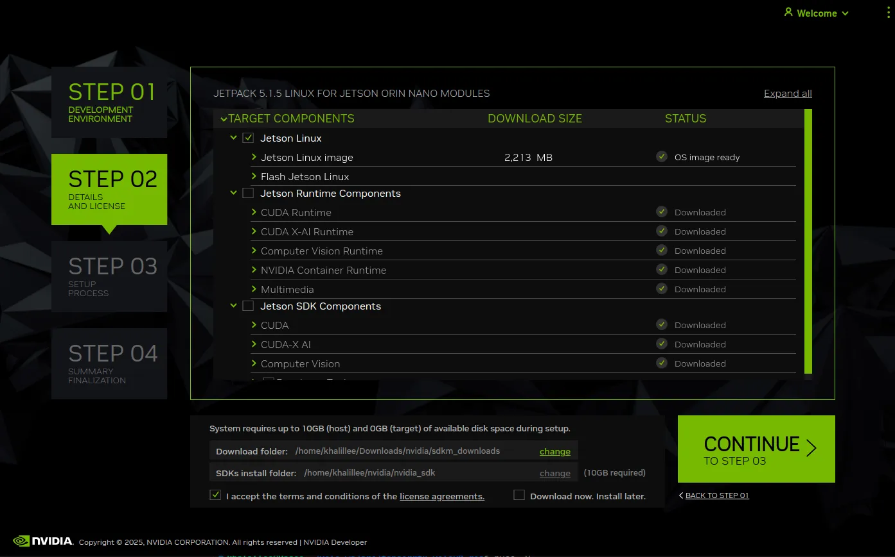

3. 如果只安装了系统，则须手动安装依赖；如果在SDKManager中安装了全部组件，则可跳过后续步骤！
```bash
sudo apt update && sudo apt upgrade
```

4. 安装CUDA并指定环境变量
```bash
sudo apt-get install cuda-toolkit-11-4
# 指定环境变量
export LD_LIBRARY_PATH=$LD_LIBRARY_PATH:/usr/local/cuda-11.4/lib64
export PATH=$PATH:/usr/local/cuda-11.4/bin
export CUDA_HOME=$CUDA_HOME:/usr/local/cuda-11.4
```

5. 安装cuDNN
```bash
sudo apt-cache policy libcudnn8
```

6. 安装TensorRT
```bash
sudo apt-cache policy tensorrt
```

7. 安装项目依赖的ROS功能包
```bash
sudo apt install -y ros-noetic-sensor-msgs ros-noetic-image-transport ros-noetic-cv-bridge ros-noetic-vision-msgs ros-noetic-image-geometry ros-noetic-pcl-conversions ros-noetic-pcl-ros ros-noetic-message-filters
```

## 克隆与编译

- 克隆此项目到本地

```bash
cd your_ws

git clone https://github.com/AgilexRobotics/GraspGen.git

catkin_make
```

## 运行

1. 启动Piper_kinematics逆解节点
```bash
# 逆解
rosrun piper_kinematics piper_ik_node

# 交互式标记
rosrun piper_kinematics interactive_pose_marker.py
```

- 或者一键启动Piper_kinematics逆解节点与交互式标记节点
```bash
roslaunch piper_kinematics piper_ik.launch
```

2. 启动Piper驱动节点并拖拽交互式标记至目标位置
```bash
cd piper_ros
# 激活CAN接口
./can_activate.sh

#启动机械臂驱动节点
roslaunch piper start_single_piper_ik_rviz.launch
```
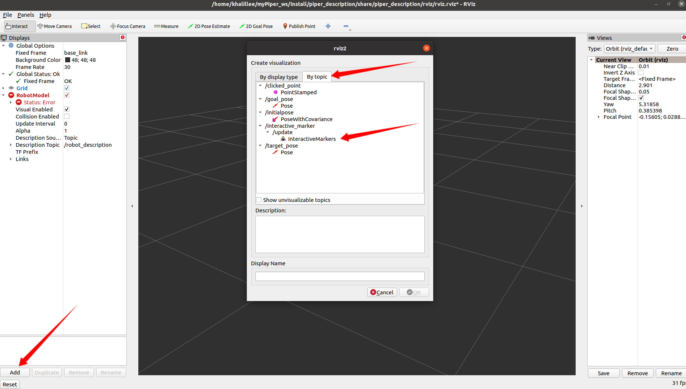

- 拖拽交互式标记至目标位置，即可驱动机械臂运动至目标位置
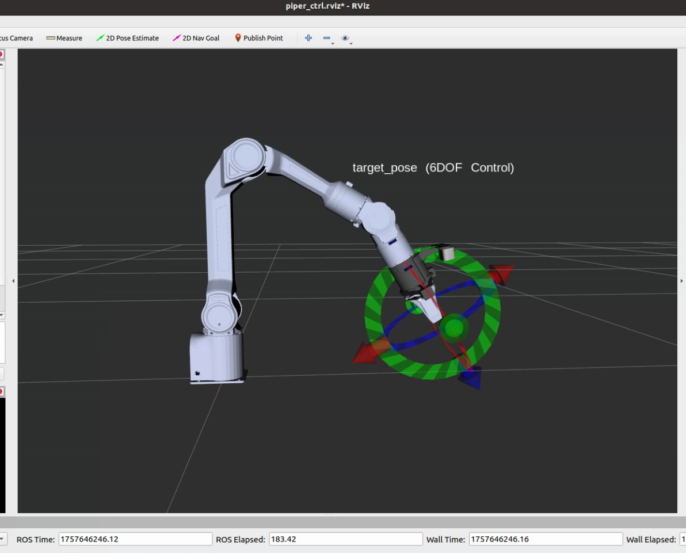


3. 启动GraspGen节点
```bash
#启动realsense相机节点
roslaunch realsense2_camera rs_aligned_depth.launch 

#启动GraspGen节点
roslaunch tensorrtx_yolov8_ros yolov8.launch
```

4. 放置物体至相机前方，即可看到GraspGen检测到的物体
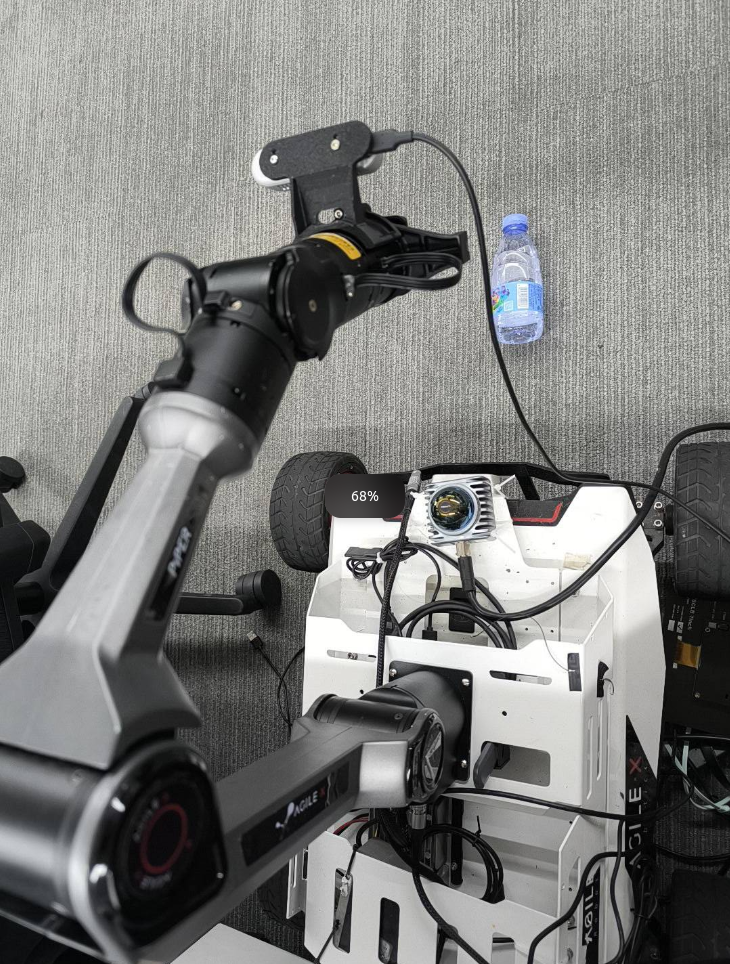
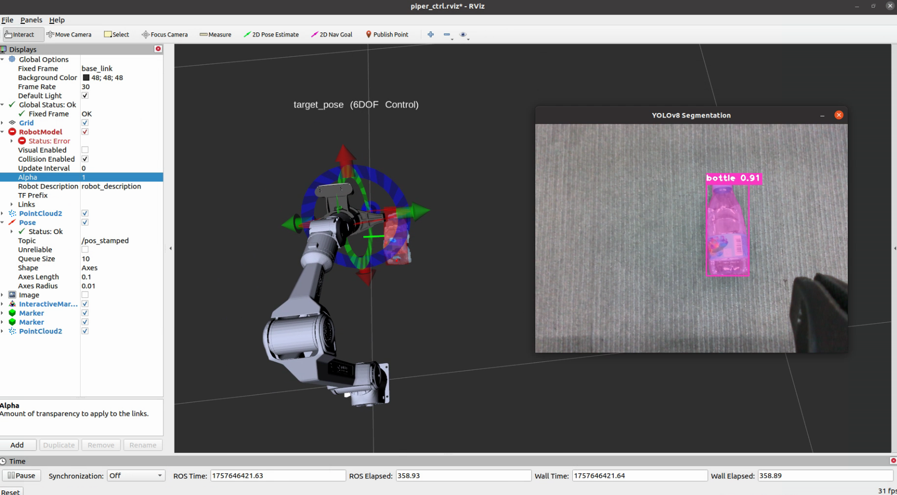

5. 添加可视化表现插件，可以看到程序正常生成物体的AABB包围盒以及经过主成分分析后的抓取姿态
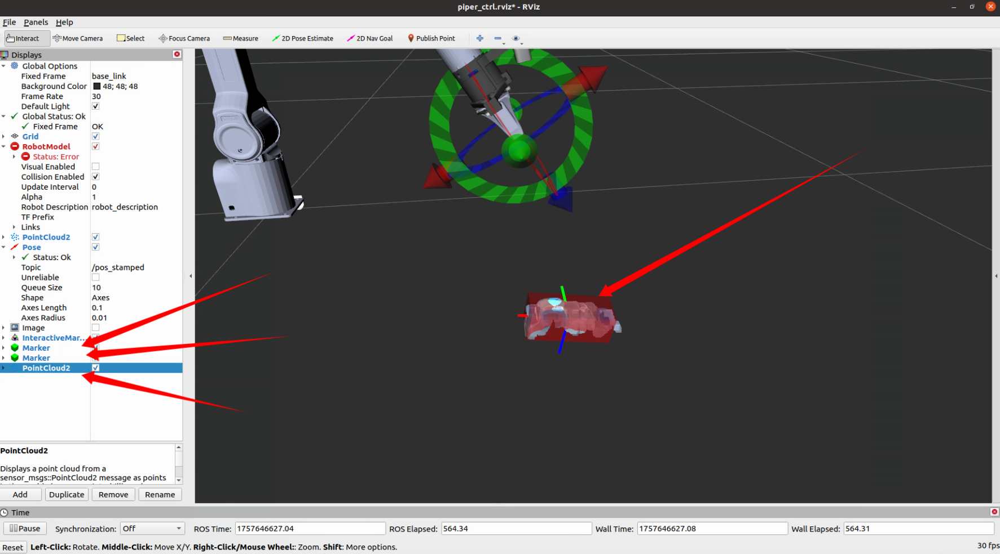

6. 执行抓取任务

- 在GraspGen节点窗口中按下小写s键，可以执行抓取任务


