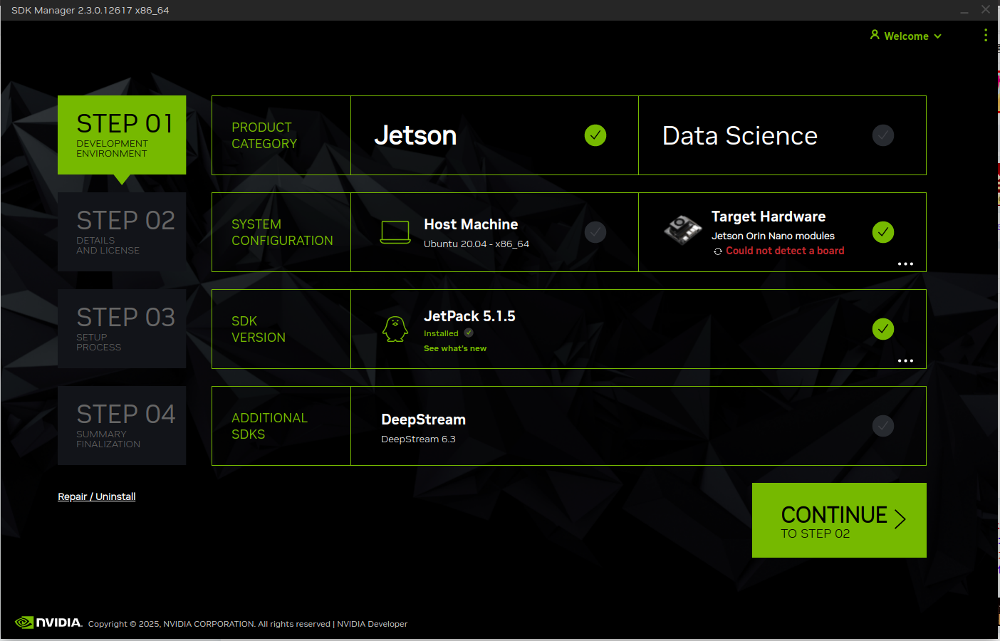
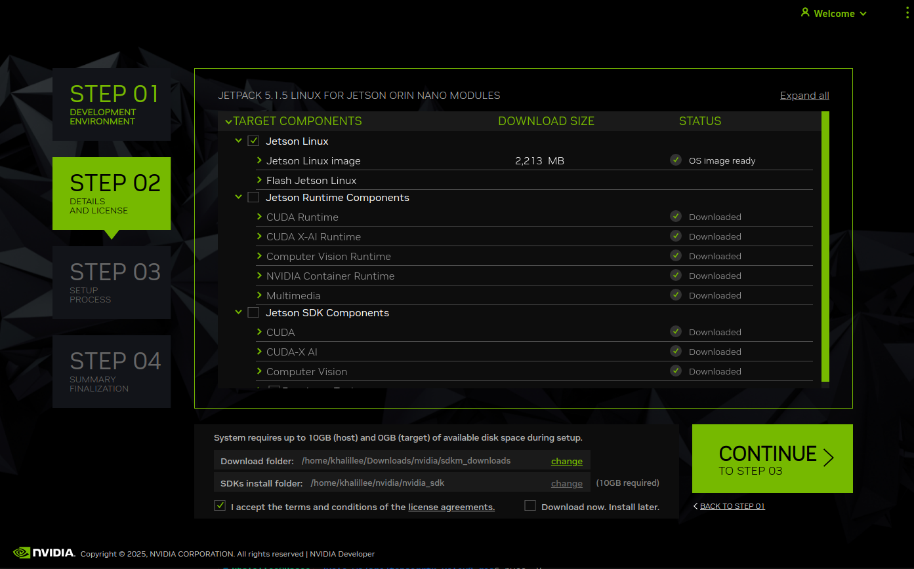
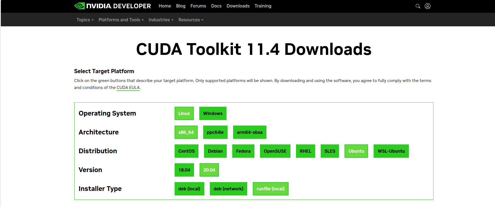
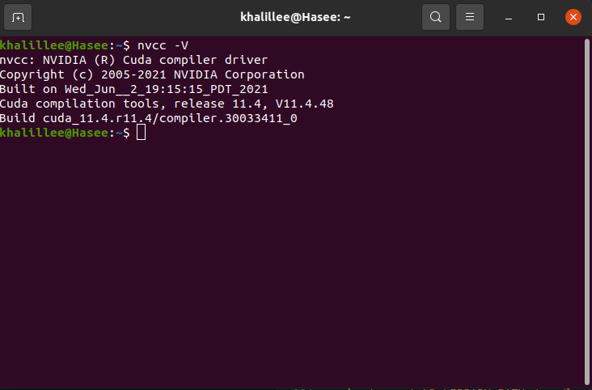
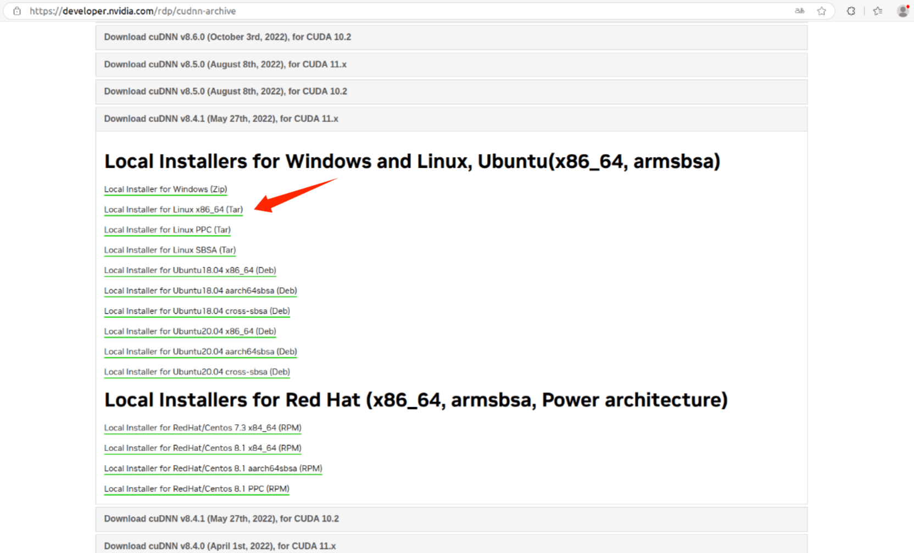
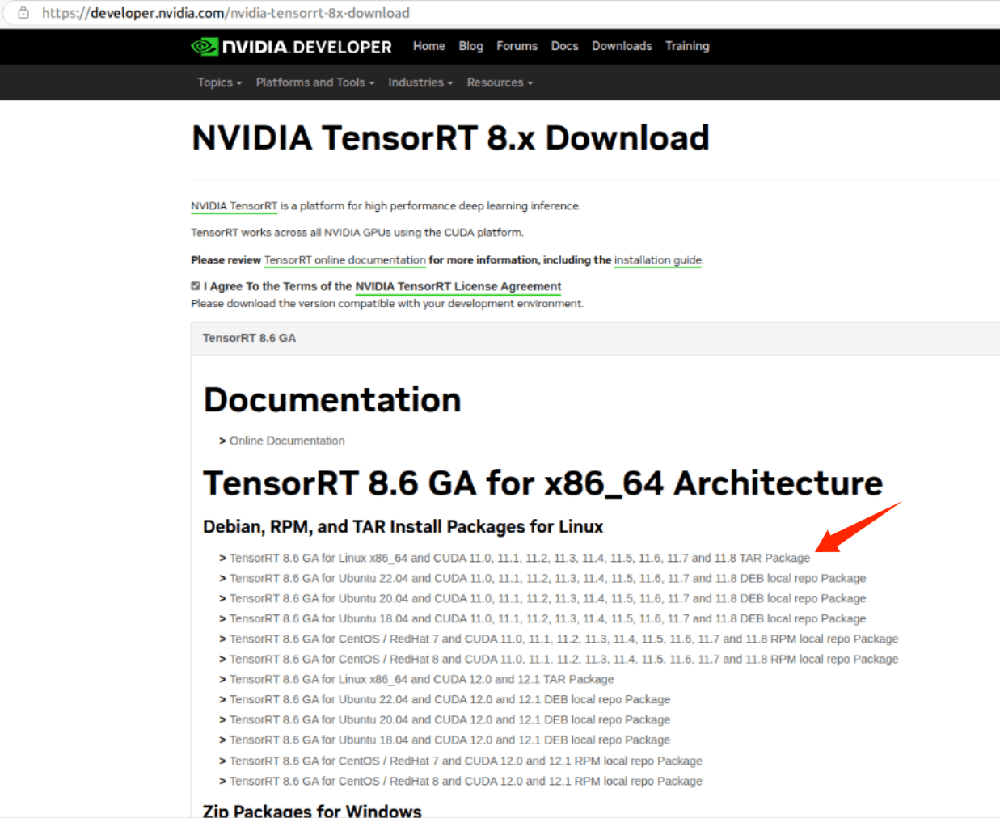
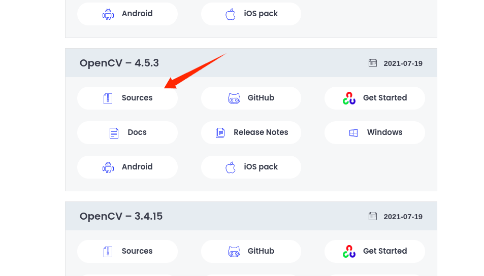
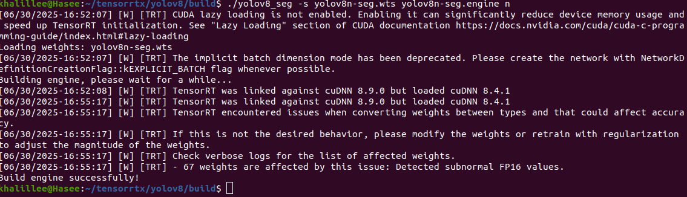
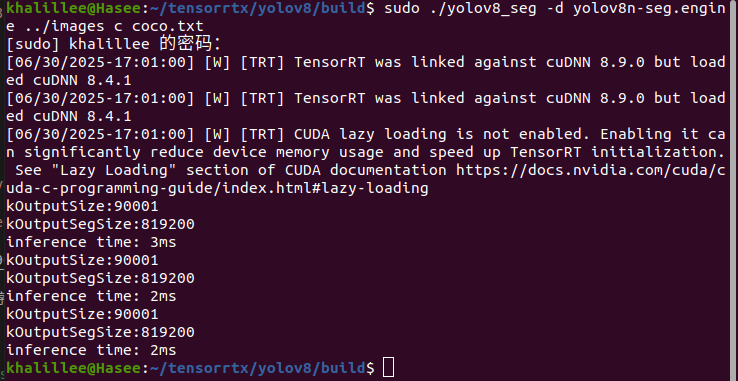
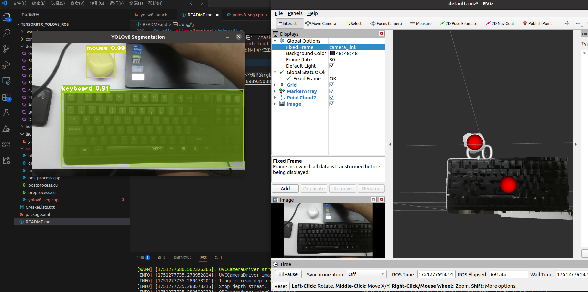

## <div align="center">文档</div>      
一个TensorRT加速的yoloV8-segmentation的ROS1移植功能包，支持桌面平台与Jetson平台双平台部署，用于深度相机的图像分割与点云提取任务与分割点云结果rviz可视化。

## <div align="center">硬件设备</div>
- [奥比中光 Petrel](https://orbbec.com.cn/index/Product/info.html?cate=38&id=28) （带对齐的深度图像与RGB图像：640*400@30fps）
- NVIDIA Jetson Orin Nano
- NVIDIA 3050laptop （带3050移动端的笔记本）

## <div align="center">环境</div>
<details open>
<summary>两个平台的软件环境</summary>

#### Jetson Orin Nano
- ubuntu20.04
- ROS noetic
- JetPack 5.1.5
- CUDA 11.4.315
- cuDNN 8.6.0.166
- TensorRT 8.5.2.2

#### 桌面端
- ubuntu20.04
- ROS noetic
- NVIDIA Driver Version: 470.256.02
- CUDA Version: 11.4
- cuDNN 8.4.1
- TensorRT 8.6.1.6
- OpenCV 4.5.3

</details>

## <div align="center">环境部署</div>
<details open>
<summary>Jetson Orin Nano等aarch平台</summary>

- step1：下载[**SDKManager**](https://developer.nvidia.com/sdk-manager)JetPack 5.1.5 
- step2：选择只刷入系统还是刷入全部组件（如果只刷了系统，后续进入系统后还可手动安装上述依赖）
- step3：刷入手动设置过程@todo
<details open>
<summary>如果只安装了系统，则须手动安装依赖；如果在SDKManager中安装了全部组件，则可跳过此步骤！</summary>

1. 更新软件
````bash
sudo apt update && sudo apt upgrade
````
2. 下载ROS noetic桌面完整版（此处使用鱼香ROS社区[**一键安装**](https://fishros.org.cn/forum/topic/20/%E5%B0%8F%E9%B1%BC%E7%9A%84%E4%B8%80%E9%94%AE%E5%AE%89%E8%A3%85%E7%B3%BB%E5%88%97)指令简化安装ROS的流程）
````bash
wget http://fishros.com/install -O fishros && . fishros
````
- <strong><em>注意不要清理本地源与第三方源， 可能会导致后续NVIDIA组件安装失败</em></strong>


3. 安装CUDA并指定环境变量
````bash
sudo apt-get install cuda-toolkit-11-4
# 指定环境变量
export LD_LIBRARY_PATH=$LD_LIBRARY_PATH:/usr/local/cuda-11.4/lib64
export PATH=$PATH:/usr/local/cuda-11.4/bin
export CUDA_HOME=$CUDA_HOME:/usr/local/cuda-11.4
````

4. 安装cuDNN
````bash
sudo apt-cache policy libcudnn8
````

5. 安装TensorRT
````bash
sudo apt-cache policy tensorrt
```` 

6. 安装项目依赖的ROS功能包
````bash
sudo apt install -y ros-noetic-sensor-msgs ros-noetic-image-transport ros-noetic-cv-bridge ros-noetic-vision-msgs ros-noetic-image-geometry ros-noetic-pcl-conversions ros-noetic-pcl-ros ros-noetic-message-filters
````

7. 克隆本项目的ROS功能包到工作空间
````bash
cd your_ws/src
git cloen https://github.com/agilexrobotics/Agilex-College.git
cd ..
catkin_make
source devel/setup.bash
````

</details>

</details>

<details open>
<summary>桌面端X86平台部署</summary>

- step1：下载ROS noetic桌面完整版（此处使用鱼香ROS社区[**一键安装**](https://fishros.org.cn/forum/topic/20/%E5%B0%8F%E9%B1%BC%E7%9A%84%E4%B8%80%E9%94%AE%E5%AE%89%E8%A3%85%E7%B3%BB%E5%88%97)指令简化安装ROS的流程）
````bash
wget http://fishros.com/install -O fishros && . fishros
````
- step2：安装NVIDIA生态
<details open>
<summary>安装NVIDIA生态</summary>

1. 安装NVIDIA驱动
````bash
sudo apt update
sudo apt upgrade
sudo add-apt-repository ppa:graphics-drivers/ppa
sudo apt update
sudo apt install nvidia-driver-470
#重启
reboot
````

2. 安装CUDA
- <strong>先前往[NVIDIA官网下载CUDA](https://developer.nvidia.com/cuda-11-4-0-download-archive?target_os=Linux&target_arch=x86_64&Distribution=Ubuntu&target_version=20.04&target_type=runfile_local)的runfile文件</strong>
- 执行安装命令
````bash
wget https://developer.download.nvidia.com/compute/cuda/11.4.0/local_installers/cuda_11.4.0_470.42.01_linux.run
sudo sh cuda_11.4.0_470.42.01_linux.run
````
- <strong><em>安装时注意<font color="red">取消勾选</font>第一项driver，因为我们<font color="red">已经安装过</font>显卡驱动</em></strong>

- 添加环境变量
````bash
echo 'export PATH=/usr/local/cuda-11.4/bin:$PATH' >> ~/.bashrc
echo 'export LD_LIBRARY_PATH=/usr/local/cuda-11.4/lib64:$LD_LIBRARY_PATH' >> ~/.bashrc
source ~/.bashrc
````

- 安装后可以执行nvcc -V查看CUDA信息
````bash
nvcc -V
````


3. 安装cuDNN

- 去[NVIDIA官网下载cuDNN的tar文件](https://developer.nvidia.com/rdp/cudnn-archive)，解压后对文件进行拷贝



- 解压后执行下面的命令把cuDNN拷贝到CUDA的安装目录下

````bash
sudo cp cuda/include/cudnn*.h /usr/local/cuda/include
sudo cp cuda/lib/libcudnn* /usr/local/cuda/lib64
sudo chmod a+r /usr/local/cuda/include/cudnn*.h /usr/local/cuda/lib64/libcudnn*
````

4. 安装TensorRT

- 去[NVIDIA官网下载TensorRT的tar文件](https://developer.nvidia.com/nvidia-tensorrt-8x-download)，解压后对文件进行拷贝



- 解压后执行下面的命令把TensorRT拷贝到/usr/local目录下

````bash
#解压
tar -xvf TensorRT-8.6.1.6.Linux.x86_64-gnu.cuda-12.0.tar.gz 

#进入TensorRT-8.6.1.6.Linux.x86_64-gnu.cuda-11.8
cd TensorRT-8.6.1.6.Linux.x86_64-gnu.cuda-11.8/

#拷贝到/usr/local目录下
sudo mv TensorRT-8.6.1.6/ /usr/local/
````

- 测试TensorRT的安装是否成功
````bash
#进入MNIST手写数字识别的目录下
cd /usr/local/TensorRT-8.6.1.6/samples/sampleOnnxMNIST

#编译
make

#在/usr/local/TensorRT-8.6.1.6/bin找到可执行文件sample_onnx_mnist
cd /usr/local/TensorRT-8.6.1.6/bin
./sample_onnx_mnist
````

- 如果TensorRT安装成功，则运行sample_onnx_mnist会看到下面的输出
````bash
@@@@@@@@@@@@@@@@@@@@@@@@@@@@
@@@@@@@@@@@@@@@@@@@@@@@@@@@@
@@@@@@@@@@@@@@@@@@@@@@@@@@@@
@@@@@@@@@@@@@@@@@@@@@@@@@@@@
@@@@@@@@@@=   ++++#++=*@@@@@
@@@@@@@@#.            *@@@@@
@@@@@@@@=             *@@@@@
@@@@@@@@.   .. ...****%@@@@@
@@@@@@@@: .%@@#@@@@@@@@@@@@@
@@@@@@@%  -@@@@@@@@@@@@@@@@@
@@@@@@@%  -@@*@@@*@@@@@@@@@@
@@@@@@@#  :#- ::. ::=@@@@@@@
@@@@@@@-             -@@@@@@
@@@@@@%.              *@@@@@
@@@@@@#     :==*+==   *@@@@@
@@@@@@%---%%@@@@@@@.  *@@@@@
@@@@@@@@@@@@@@@@@@@+  *@@@@@
@@@@@@@@@@@@@@@@@@@=  *@@@@@
@@@@@@@@@@@@@@@@@@*   *@@@@@
@@@@@%+%@@@@@@@@%.   .%@@@@@
@@@@@*  .******=    -@@@@@@@
@@@@@*             .#@@@@@@@
@@@@@*            =%@@@@@@@@
@@@@@@%#+++=     =@@@@@@@@@@
@@@@@@@@@@@@@@@@@@@@@@@@@@@@
@@@@@@@@@@@@@@@@@@@@@@@@@@@@
@@@@@@@@@@@@@@@@@@@@@@@@@@@@
````

5. 安装OpenCV

- 去[官网下载OpenCV 4.5.3](https://opencv.org/releases/page/2/)，解压后进入目录



- 下载依赖

````bash
sudo apt install build-essential cmake git pkg-config libgtk-3-dev libavcodec-dev libavformat-dev libswscale-dev libv4l-dev libxvidcore-dev libx264-dev libjpeg-dev libpng-dev libtiff-dev gfortran openexr libatlas-base-dev python3-dev python3-numpy libtbb2 libtbb-dev libdc1394-22-dev
````
- [Github下载opencv_contrib](https://github.com/opencv/opencv_contrib.git)并将opencv_contrib放入opencv目录里（也可以放在其他目录，但需要修改cmake编译时的命令）

````bash
cd opencv-4.5.3
git clone https://github.com/opencv/opencv_contrib.git
````

- 预编译，执行下面的命令指定编译时候的参数，<font color=red>注意<strong><em>`-D OPENCV_EXTRA_MODULES_PATH=your_opencv-contirb-modules_path`</em></strong>修改为自定义的路径</font>

````bash
cmake \
-D WITH_CUDA=ON \
-D CUDA_ARCH_BIN="8.6" \
-D WITH_CUDNN=ON \
-D OPENCV_DNN_CUDA=ON  \
-D cuDNN_VERSION='8.4' \
-D cuDNN_INCLUDE_DIR='/usr/local/cuda/include' \
-D CUDA_ARCH_PTX="" \
-D OPENCV_EXTRA_MODULES_PATH=/home/khalillee/opencv-4.5.3/opencv_contrib-4.5.3/modules \
-D WITH_GSTREAMER=ON \
-D WITH_LIBV4L=ON  \
-D BUILD_opencv_python3=ON \
-D BUILD_TESTS=OFF \
-D BUILD_PERF_TESTS=OFF \
-D BUILD_EXAMPLES=OFF \
-D CMAKE_BUILD_TYPE=RELEASE \
-D CMAKE_INSTALL_PREFIX=/usr/local \
-D ENABLE_FAST_MATH=1 \
-D CUDA_FAST_MATH=1 \
-D WITH_CUBLAS=1 \
-D PYTHON3_EXECUTABLE=$(which python3) \
-D PYTHON3_INCLUDE_DIR=$(python3 -c "from distutils.sysconfig import get_python_inc; print(get_python_inc())") \
-D PYTHON3_PACKAGES_PATH=$(python3 -c "from distutils.sysconfig import get_python_lib; print(get_python_lib())") \
-D OPENCV_ENABLE_NONFREE=ON \
-D PYTHON3_NUMPY_INCLUDE_DIRS=/usr/lib/python3/dist-packages/numpy/core/include \
-D PYTHON3_PACKAGES_PATH=/usr/lib/python3/dist-packages \
-D PYTHON_DEFAULT_EXECUTABLE=$(which python3) \
-D OPENCV_PYTHON3_INSTALL_PATH=/usr/lib/python3/dist-packages \
-D BUILD_opencv_python3=ON \
-D BUILD_opencv_python2=OFF \
-D HAVE_opencv_python3=ON \
-D INSTALL_PYTHON_EXAMPLES=ON \
-D INSTALL_C_EXAMPLES=ON \
-D BUILD_opencv_python3=ON \
-D OPENCV_GENERATE_PKGCONFIG=YES \
.. 
````

- 编译安装，速度较慢

````bash
# nproc为CPU线程数量
make -j$(nproc) 

#安装
sudo make install
````

- 将OpenCV的库添加到环境
````bash
sudo gedit /etc/ld.so.conf.d/opencv4.conf 
````
执行此命令后打开的可能是一个空白的文件，只需要<strong><font color=red>在文件末尾添加</font>`/usr/local/lib`</strong>

- 更新系统动态链接器缓存，使系统能够正确地找到库文件

````bash
sudo ldconfig
````

- 配置环境变量，编辑`/etc/bash.bashrc`
````bash
sudo gedit /etc/bash.bashrc

#在文件最后添加
PKG_CONFIG_PATH=$PKG_CONFIG_PATH:/usr/local/lib/pkgconfig 
export PKG_CONFIG_PATH 
#然后保存并退出
````

- 然后执行`source /etc/bash.bashrc`使环境变量生效，最后输入`pkg-config --modversion opencv4`来查看opencv的版本
````bash
source /etc/bash.bashrc
sudo updatedb

pkg-config --modversion opencv4
````

6. 安装此项目所依赖的ROS包
````bash
sudo apt install -y ros-noetic-sensor-msgs ros-noetic-image-transport ros-noetic-cv-bridge ros-noetic-vision-msgs ros-noetic-image-geometry ros-noetic-pcl-conversions ros-noetic-pcl-ros ros-noetic-message-filters
````

7. 克隆并编译此功能包
````bash
cd your_ws/src
git cloen https://github.com/agilexrobotics/Agilex-College.git
cd ..
catkin_make
source devel/setup.bash
````

</details>

</details>

## <div align="center">权重导出与engien生成</div>
此项目基于tensorrtx中的yoloV8部分进行改动以适配ROS，其中权重导出与engine生成部分的代码来自tensorrtx中的yoloV8部分，具体可参考[tensorrtx](https://github.com/wang-xinyu/tensorrtx)中的项目，以下是此项目需要在tensorrtx中执行的步骤：

- 克隆tensorrtx
````bash
git clone https://github.com/wang-xinyu/tensorrtx
````

- 编译yoloV8部分
````bash
cd tensorrtx/yolov8
mkdir build
cd build
cmake ..
make -j$(nproc)
````

- 下载ultralytics和权重文件
<font color=red>注意：ultralytics<=8.2.103</font>

````bash
#克隆ultralytics
git clone https://github.com/ultralytics/ultralytics.git

#下载yoloV8n-seg.pt权重文件
wget https://github.com/ultralytics/assets/releases/download/v8.2.0/yolov8n-seg.pt

#下载标签文件
wget -O coco.txt https://raw.githubusercontent.com/amikelive/coco-labels/master/coco-labels-2014_2017.txt
````

- 导出yoloV8n-seg.pt权重文件的wts

````bash
#复制tensorrtx/yolo8里的gen_wts.py到ultralytics/ultralytics里
cp {tensorrtx_psth}/yolov8/gen_wts.py {ultralytics_path}/ultralytics

#进入ultralytics/ultralytics
cd {ultralytics_path}/ultralytics

#生成wts文件
python gen_wts.py -w yolov8n-seg.pt -o yolov8n-seg.wts -t seg
#复制engine文件回tensorrtx/yolov8/build/
cp yolov8n-seg.wts {tensorrtx_path}/yolov8/build/
````

- 导出engine文件 

````bash
#生成engine文件
cd {tensorrtx_path}/yolov8/build/

sudo ./yolov8_seg -s yolov8n-seg.wts yolov8n-seg.engine n
#如果报错请执行
./yolov8_sge -s yolov8n-seg.wts yolov8n-seg.engine n
````


- 运行yolov8_seg测试tensorrtx是否正常运行，程序会自动遍历images/里的图片

````bash
#测试tensorrtx是否正常运行，程序会自动遍历images/里的图片
cd {tensorrtx_path}/yolov8/build/
sudo ./yolov8_seg -d yolov8n-seg.engine ../images c coco.txt
#如果报错请执行
./yolov8_seg -d yolov8n-seg.engine ../images c coco.txt
````


- 此处正常运行之后说明环境配置得没有问题，可以开始运行此仓库的功能包了

## <div align="center">运行</div>

<details open>
<summary>运行示例</summary>

1. 克隆功能包到工作空间
````bash
cd your_ws/src
git cloen https://github.com/agilexrobotics/Agilex-College
cd ..
catkin_make
source devel/setup.bash
````

2. 启动深度相机节点

需要相机能<font color=red>自动对齐</font>RGB图像与深度图像，此项目暂时没有开发自动对齐功能，对齐后的深度图像与RGB图像长宽一致。此项目使用[奥比中光 Petrel](https://orbbec.com.cn/index/Product/info.html?cate=38&id=28)深度相机作为功能测试，具体配置运行示例以及设置请参考[奥比中光相机驱动仓库](https://github.com/orbbec/ros_astra_camera.git)

````bash
source devel/setup.bash
roslaunch roslaunch astra_camera dabai_dc1.launch 
````

- 程序运行后会发布以下话题，其中`/camera/color/`为RGB彩色图像的数据，`/camera/depth/`为深度图像的数据，`/camera/depth/points`为点云数据，`/camera/ir/`为红外图像的数据。


````bash
/camera/color/camera_info
/camera/color/image_raw
/camera/depth/camera_info
/camera/depth/image_raw
/camera/depth/points
/camera/depth_registered/points
/camera/ir/camera_info
/camera/ir/image_raw
/rosout
/rosout_agg
/tf
/tf_static
````

<details close>
<summary>dabai_dc1.launch配置参数</summary>

````bash

<launch>
    <!-- unique camera name-->
    <arg name="camera_name" default="camera"/>
    <!-- Hardware depth registration -->
    <arg name="depth_align" default="true"/>
    <arg name="serial_number" default=""/>
    <arg name="device_num" default="1"/>
    <arg name="vendor_id" default="0x2bc5"/>
    <arg name="product_id" default=""/>
    <arg name="enable_point_cloud" default="true"/>
    <arg name="enable_point_cloud_xyzrgb" default="true"/>
    <arg name="connection_delay" default="100"/>
    <arg name="color_width" default="640"/>
    <arg name="color_height" default="480"/>
    <arg name="color_fps" default="30"/>
    <arg name="enable_color" default="true"/>
    <arg name="flip_color" default="false"/>
    <arg name="color_format" default="RGB"/>
    <arg name="depth_width" default="640"/>
    <arg name="depth_height" default="400"/>
    <arg name="depth_fps" default="30"/>
    <arg name="enable_depth" default="true"/>
    <arg name="flip_depth" default="false"/>
    <arg name="depth_format" default="Y11"/>
    <arg name="ir_width" default="640"/>
    <arg name="ir_height" default="480"/>
    <arg name="ir_fps" default="30"/>
    <arg name="enable_ir" default="true"/>
    <arg name="ir_format" default="Y10"/>
    <arg name="flip_ir" default="false"/>
    <arg name="publish_tf" default="true"/>
    <arg name="tf_publish_rate" default="10.0"/>
    <arg name="ir_info_uri" default=""/>
    <arg name="color_info_uri" default=""/>
    <arg name="color_roi_x" default="0"/>
    <arg name="color_roi_y" default="0"/>
    <arg name="color_roi_width" default="640"/>
    <arg name="color_roi_height" default="400"/>
    <arg name="color_depth_synchronization" default="true"/>
    <arg name="depth_roi_x" default="-1"/>
    <arg name="depth_roi_y" default="-1"/>
    <arg name="depth_roi_width" default="-1"/>
    <arg name="depth_roi_height" default="-1"/>
    <arg name="depth_scale" default="1"/>
    <arg name="use_uvc_camera" default="true"/>
    <arg name="uvc_vendor_id" default="0x2bc5"/>
    <arg name="uvc_product_id" default="0x0557"/>
    <arg name="uvc_retry_count" default="100"/>
    <arg name="uvc_camera_format" default="mjpeg"/>
    <arg name="uvc_flip" default="false"/>
    <arg name="oni_log_level" default="verbose"/>
    <arg name="oni_log_to_console" default="false"/>
    <arg name="oni_log_to_file" default="false"/>
    <arg name="enable_d2c_viewer" default="false"/>
    <arg name="enable_publish_extrinsic" default="false"/>
    <arg name="enable_keep_alive" default="false"/>

    <group ns="$(arg camera_name)">
        <node name="camera" pkg="astra_camera" type="astra_camera_node" output="screen">
            <param name="camera_name" value="$(arg camera_name)"/>
            <param name="depth_align" value="$(arg depth_align)"/>
            <param name="serial_number" type="string" value="$(arg serial_number)"/>
            <param name="device_num" value="$(arg device_num)"/>
            <param name="vendor_id" value="$(arg vendor_id)"/>
            <param name="product_id" value="$(arg product_id)"/>
            <param name="enable_point_cloud" value="$(arg enable_point_cloud)"/>
            <param name="enable_point_cloud_xyzrgb" value="$(arg enable_point_cloud_xyzrgb)"/>
            <param name="connection_delay" value="$(arg connection_delay)"/>
            <param name="color_width" value="$(arg color_width)"/>
            <param name="color_height" value="$(arg color_height)"/>
            <param name="color_fps" value="$(arg color_fps)"/>
            <param name="enable_color" value="$(arg enable_color)"/>
            <param name="color_format" value="$(arg color_format)"/>
            <param name="flip_color" value="$(arg flip_color)"/>
            <param name="depth_width" value="$(arg depth_width)"/>
            <param name="depth_height" value="$(arg depth_height)"/>
            <param name="depth_fps" value="$(arg depth_fps)"/>
            <param name="flip_depth" value="$(arg flip_depth)"/>
            <param name="enable_depth" value="$(arg enable_depth)"/>
            <param name="depth_format" value="$(arg depth_format)"/>
            <param name="ir_width" value="$(arg ir_width)"/>
            <param name="ir_height" value="$(arg ir_height)"/>
            <param name="ir_fps" value="$(arg ir_fps)"/>
            <param name="enable_ir" value="$(arg enable_ir)"/>
            <param name="flip_ir" value="$(arg flip_ir)"/>
            <param name="ir_format" value="$(arg ir_format)"/>
            <param name="publish_tf" value="$(arg publish_tf)"/>
            <param name="tf_publish_rate" value="$(arg tf_publish_rate)"/>
            <param name="ir_info_uri" value="$(arg ir_info_uri)"/>
            <param name="color_info_uri" value="$(arg color_info_uri)"/>
            <param name="color_roi_x" value="$(arg color_roi_x)"/>
            <param name="color_roi_y" value="$(arg color_roi_y)"/>
            <param name="color_roi_width" value="$(arg color_roi_width)"/>
            <param name="color_roi_height" value="$(arg color_roi_height)"/>
            <param name="color_depth_synchronization" value="$(arg color_depth_synchronization)"/>
            <param name="depth_roi_x" value="$(arg depth_roi_x)"/>
            <param name="depth_roi_y" value="$(arg depth_roi_y)"/>
            <param name="depth_roi_width" value="$(arg depth_roi_width)"/>
            <param name="depth_roi_height" value="$(arg depth_roi_height)"/>
            <param name="depth_scale" value="$(arg depth_scale)"/>
            <param name="use_uvc_camera" value="$(arg use_uvc_camera)"/>
            <param name="uvc_vendor_id" value="$(arg uvc_vendor_id)"/>
            <param name="uvc_product_id" value="$(arg uvc_product_id)"/>
            <param name="uvc_retry_count" value="$(arg uvc_retry_count)"/>
            <param name="uvc_camera_format" value="$(arg uvc_camera_format)"/>
            <param name="uvc_flip" value="$(arg uvc_flip)"/>
            <param name="oni_log_level" value="$(arg oni_log_level)"/>
            <param name="oni_log_to_console" value="$(arg oni_log_to_console)"/>
            <param name="oni_log_to_file" value="$(arg oni_log_to_file)"/>
            <param name="enable_d2c_viewer" value="$(arg enable_d2c_viewer)"/>
            <param name="enable_publish_extrinsic" value="$(arg enable_publish_extrinsic)"/>
            <param name="enable_keep_alive" value="$(arg enable_keep_alive)"/>
            <remap from="/$(arg camera_name)/depth/color/points" to="/$(arg camera_name)/depth_registered/points"/>
        </node>
    </group>
</launch>

````

</details>

3. 启动此项目tensorrtx_yolov8_ros的launch文件

````bash
source devel/setup.bash
roslaunch tensorrtx_yolov8_ros yolov8.launch
````

<details close>
<summary>yolov8.launch配置参数</summary>

````bash
<launch>
    <arg name="engine_path" default="$(find tensorrtx_yolov8_ros)/config/yolov8n-seg.engine"/>
    <arg name="labels_path" default="$(find tensorrtx_yolov8_ros)/config/coco.txt"/>
    <arg name="cuda_post_process" default="c"/>  <!-- 'c' for CPU or 'g' for GPU post-processing -->
    <arg name="debug" default="true"/>
    <arg name="publish_results" default="false"/>
    <arg name="color_image_topic" default="/camera/color/image_raw"/>
    <arg name="depth_camera_info_topic" default="/camera/depth/camera_info"/>
    <arg name="depth_image_topic" default="/camera/depth/image_raw"/>


    <node pkg="tensorrtx_yolov8_ros" type="yolov8_seg" name="yolov8_seg_node" output="screen">
        <param name="engine_path" value="$(arg engine_path)"/>
        <param name="labels_path" value="$(arg labels_path)"/>
        <param name="cuda_post_process" value="$(arg cuda_post_process)"/>
        <param name="debug" value="$(arg debug)"/>
        <param name="publish_results" value="$(arg publish_results)"/>
        <param name="depth_camera_info_topic" value="$(arg depth_camera_info_topic)"/>
        <param name="depth_image_topic" value="$(arg depth_image_topic)"/>
        <param name="color_image_topic" value="$(arg color_image_topic)"/>
    </node>

</launch>
````

</details>

4. 启动后可以发现多发布了两个话题，分别是：`/masked_pointcloud`、`/object_centroids`，其中`/masked_pointcloud`是物体分割后对应的点云，`/object_centroids`是物体分割后对应的物体中心点坐标，可以使用rviz进行可视化

````bash
rostopic list 
/camera/color/camera_info
/camera/color/image_raw
/camera/depth/camera_info
/camera/depth/image_raw
/camera/depth/points
/camera/depth_registered/points
/camera/ir/camera_info
/camera/ir/image_raw
/clicked_point
/initialpose
/masked_pointcloud
/object_centroids
/rosout
/rosout_agg
/tf
/tf_static
````

- 下图为可视化结果，其中rviz界面中间部分为分割出的rgbd点云，分别对应鼠标与键盘的点云，左侧为分割出的物体的掩膜，分别对应鼠标与键盘，其中rviz中显示的橙红色球体是yolov8-segmentation分割出物体的点云的形心。


</details>